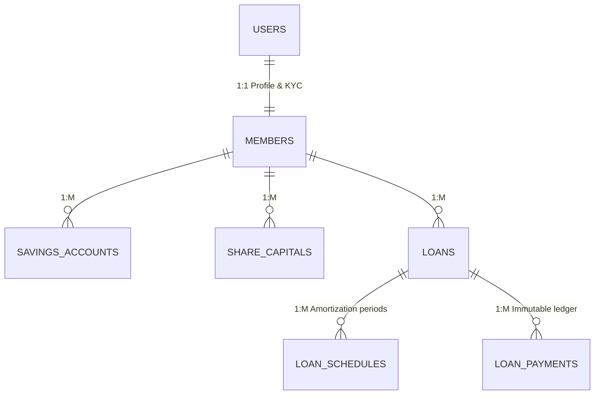

# Cooperative Management System (CMS)

A single tenant web product, production-ready, highly secure, and audit-compliant Cooperative Management System built with Laravel 11. This system manages member registrations, share capital, savings accounts, and complex loan amortization schedules.

## 🚀 Project Overview

Financial applications require absolute data integrity. This system was built using **Domain-Driven Design (DDD)** principles, focusing on immutable financial ledgering and strict architectural constraints to prevent data drift and race conditions.

### Core Architectural Rules Enforced:
* **Dynamic Computation:** Balances (e.g., remaining loan balances, total savings) are NEVER stored as static database columns. They are calculated dynamically on-the-fly via Eloquent summations to guarantee the UI always matches the immutable ledger.
* **Concurrency Protection:** Database transactions utilize Pessimistic Locking (`lockForUpdate()`) to prevent race conditions during concurrent financial operations.
* **Immutable Audit Ledger:** Every state change in the financial tables is tracked via a `MemberAuditLog`, capturing the exact state before and after the transaction, alongside the ID of the authorizing user.

## ✨ Key Features

* **Role-Based Access Control:** Strict separation between Administrative Staff (financial processors) and Cooperative Members.
* **Share Capital & Savings Ledger:** Tracks deposits, withdrawals, and minimum maintaining balances.
* **Advanced Loan Processing Engine:**
  * Automated Amortization Schedule generation.
  * **Waterfall Payment Allocation:** A custom payment engine that automatically cascades incoming cash to satisfy outstanding interest first, then principal, based on the oldest pending periods.
  * Handles advance principal overflow seamlessly.
* **Data Privacy:** Uses secure string identifiers (`member_id_number`) for URL routing to prevent database ID enumeration.

## 💻 Tech Stack

* **Framework:** Laravel 11 (PHP 8.2+)
* **Frontend:** Tailwind CSS, Laravel Breeze (Blade Components)
* **Database:** MySQL
* **Asset Bundling:** Vite

## 🛠️ Installation & Setup

To run this project locally, follow these steps:

1. **Clone the repository:**
   ```bash
   git clone [https://github.com/YOUR_USERNAME/YOUR_REPOSITORY_NAME.git](https://github.com/YOUR_USERNAME/YOUR_REPOSITORY_NAME.git)
   cd YOUR_REPOSITORY_NAME
   ```

2. **Install PHP dependencies:**
   ```bash
   composer install
   ```

3. **Set up your environment:**
   ```bash
   cp .env.example .env
   php artisan key:generate
   ```
   *(Ensure you configure your database connection settings in the `.env` file).*

4. **Run migrations and seeders:**
   ```bash
   php artisan migrate --seed
   ```

5. **Install and compile frontend assets:**
   ```bash
   npm install
   npm run dev
   ```

6. **Serve the application:**
   ```bash
   php artisan serve
   ```

## 📐 Database Entity Relationship (ERD) Highlights




## ⚠️ Current Status: Under Active Development

**Please Note:** This project is currently **ongoing and in active development**. While the core domain rules, structural architecture, and ledger foundations are established, several modules, UI layouts, and auxiliary features are unfinished or undergoing heavy iteration. Expect frequent changes to the database schemas and internal APIs until the initial release build is tagged.
```